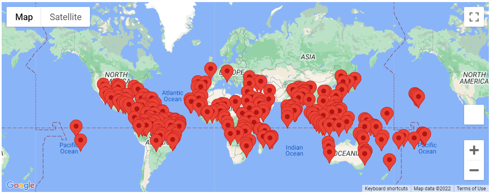
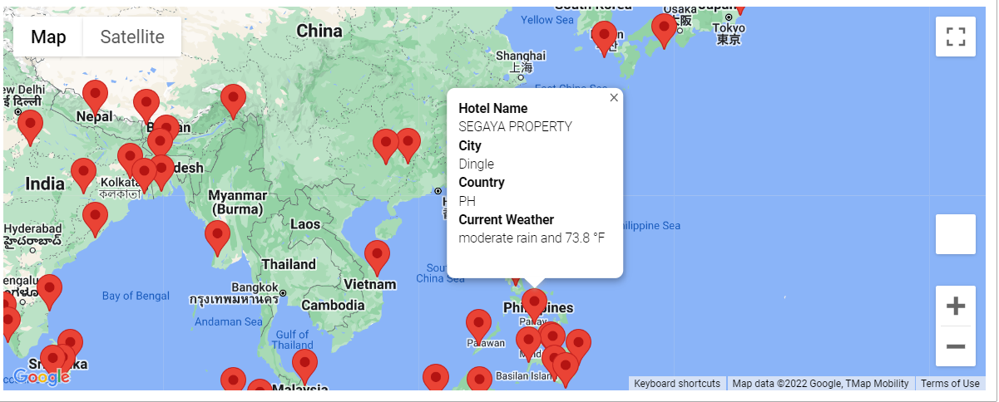
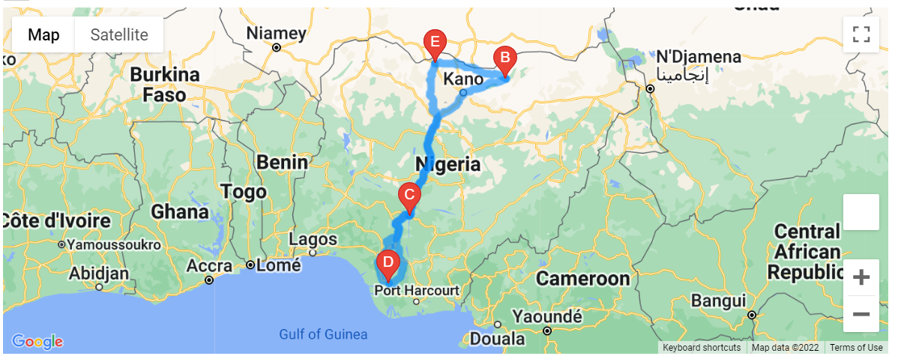
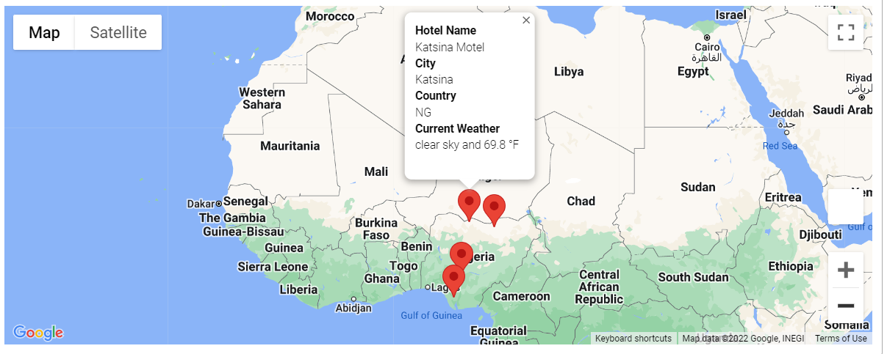

# M6_WeatherPy_APIs
Module 6 Challenge:

This challenge used OpenWeatherMap API and a GoogleMaps API to add weather data to the PlanMyTrip app. 

## Deliverable 1

For this deliverable, OpenWeatherMap data was retrieved for 717 cities, using the Citipy library and a list of 2000 random coordinates. For each city, the maximum temperature, humidity, cloudiness, wind speed and current weather description were collected. 

## Deliverable 2

For this deliverable, input statements were used to produce a list of possible travel destinations based on a range of customers' maximum temperature preferences (68 - 85 F). We then used Google Maps Places API to find hotels in those locations, and plot them on an interactive map. See Figures 1 and 2.

## Deliverable 3

For this deliverable, Google Directions API was used to plot driving directions between four cities in Nigeria. See Figures 3 and 4.

